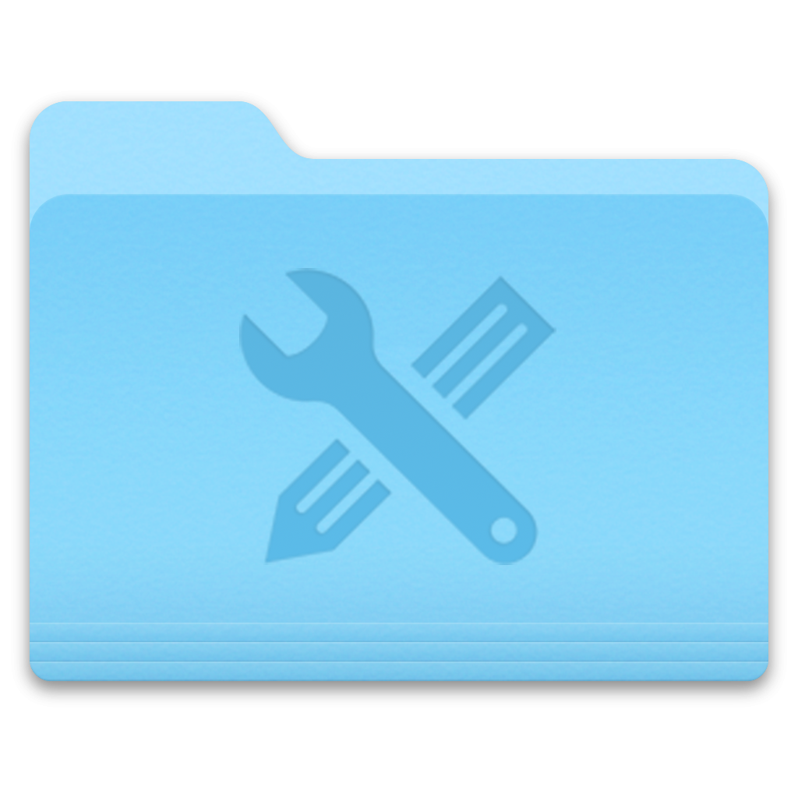

<!-- PROJECT SHIELDS -->

[![Contributors][contributors-shield]][contributors-url]
[![Forks][forks-shield]][forks-url]
[![Stargazers][stars-shield]][stars-url]
[![Issues][issues-shield]][issues-url]
[![LinkedIn][linkedin-shield]][linkedin-url]

<!-- PROJECT LOGO -->
 

  

  <h3 align="center">Custom MacOS Folder Icons</h3>

  

    Pack of custom folder 📂 icons for MacOS, Linux, and Windows.
     
    <a href="https://github.com/othneildrew/Best-README-Template">View Demo</a>
    ·
    <a href="https://github.com/othneildrew/Best-README-Template/issues">Report Bug</a>
    ·
    <a href="https://github.com/othneildrew/Best-README-Template/issues">Request Feature</a>
  

<!-- TABLE OF CONTENTS -->
## Table of Contents

* [About the Project](#about-the-project)
  * [Built With](#built-with)
* [Getting Started](#getting-started)
  * [Prerequisites](#prerequisites)
  * [Installation](#installation)
* [Usage](#usage)
* [Roadmap](#roadmap)
* [Contributing](#contributing)
* [License](#license)
* [Contact](#contact)
* [Acknowledgements](#acknowledgements)

### Make a request!

Hey, I am open to suggestions 😉 so you can just let me know what icons you would like!

### How to ask for a Folder Icon

Simple😎

- Drop me a message 💬 [here](https://markksantos.com/contact).
- Follow me on Instagram [@markksantos](https://www.instagram.com/markksantos/) or Twitter [@markksantos](https://twitter.com/markksantos)
